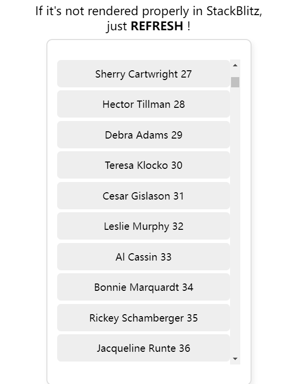

# Virtual List Demo

> Acknowledgement:
>
> + ~~Best Forum~~ - [「前端进阶」高性能渲染十万条数据(虚拟列表) - 掘金 (juejin.cn)](https://juejin.cn/post/6844903982742110216)

A really rough demo of virtual list, aka virtual scroller.

Demo: [StackBlitz](https://stackblitz.com/edit/vitejs-vite-afjm4m?file=package.json)

## Screenshot




## useVirtualList hook

```tsx
// useVirtualList.tsx
/**
* itemHeight: the fixed height of every rendered list-item
* totalNum: the length of the long long list
*/
export function useVirtualList(itemHeight: number, totalNum: number) {
  // container Ref for capturing its clientHeight
  const containerRef = useRef<HTMLDivElement>(null)

  // the start index of the visible list
  const [startIndex, setStart] = useState(0),
  // the volume of the container (how many items it can display)
  [volume, setVolume] = useState(0),
  // the ending index of the visible list
  [endIndex, setEnd] = useState(0),
  // the offset which the visible list is away from the scrollable container
  [startOffset, setOffset] = useState(0)

  // get basic info via the containerRef
  useEffect(() => {
    if (containerRef.current) {
      setVolume(Math.ceil(containerRef.current.clientHeight / itemHeight) + 1)

      containerRef.current.onscroll = (e: Event) => {
        if (containerRef.current) {
          const scrollTop = containerRef.current.scrollTop
          setStart(Math.floor(scrollTop / itemHeight))
          setOffset(scrollTop - scrollTop % itemHeight)
        }
      }
    }

    return () => {
      containerRef.current && (containerRef.current.onscroll = null)
    }
  }, [containerRef])

  // watch the startIndex and volume states to compute the endIndex
  useEffect(() => {
    setEnd(Math.min(totalNum, startIndex + volume))
  }, [startIndex, volume])

  // now component use these to compute the visible items, and translate the visible list
  return {
    containerRef,
    startIndex,
    endIndex,
    startOffset
  }
}

// VirtualList.tsx
const VirtualList: FC<ListProps> = ({ list, itemHeight = 50 }) => {
  
  const {
    containerRef,
    startIndex,
    endIndex,
    startOffset
  } = useVirtualList(itemHeight, list.length)
  
  return (
    <div className="list-container" ref={containerRef}>
      <div className="list-scroll-layer" style={{ height: list.length * itemHeight }}></div>
      <div className="list-vision" style={{ transform: `translate3d(0px, ${startOffset}px, 0px)` }}>
        {list.slice(startIndex, endIndex).map(({ content, key }) => (
          <div className="list-item" key={key}>
            {content} {key}
          </div>
        ))}
      </div>
    </div>
  );
};
```
